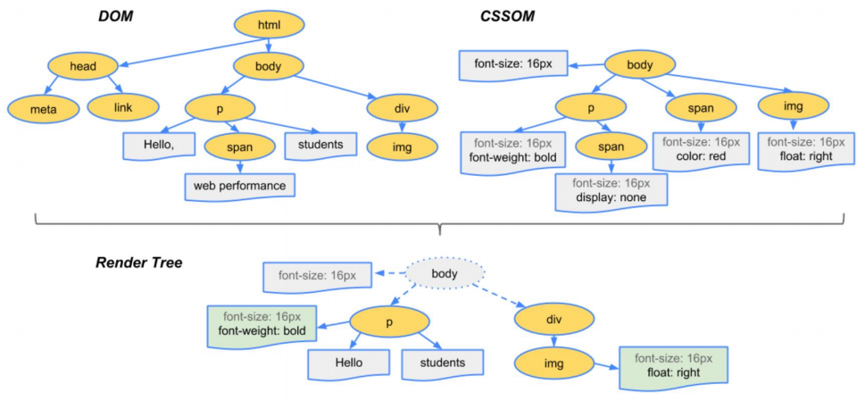
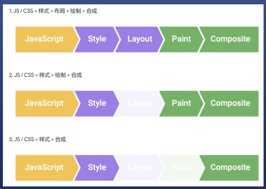

# CSS知识总结
 * css基础
 * css布局
 * css定位
 * css动画

## css的基础语法
* css的层叠样式是什么
* 可以多次对同一个选择器进行样式声明 课可以用不同选择器对同一个元素进行样式声明  可以用多个文件进行声明
* css是艺术 你要用感性的思维理解
* 语法很简单
* 语法1:样式语法  选择器{属性:属性值;} 
* 注意事项 所有符号都是英文符号 如果写错了 浏览器会警告 区分大小写 最后一个分号可以省略但是最后不要 
* 语法2: at语法
* @charset "UTF-8"; @import url(2.css);
@media (min-width: 100px) and (max-width: 200px)
* 注意事项 @charset 必须放在第一行 前两个at必须以分号 结尾   charset是字符的意思  但UTF-8 是字符偏码
* 如何调试css
* 方法 使用vsCode Webstorm 看颜色 使用开发者工具看警告 
* 如何使用开发者工具 找到你脑中的标签 看它是否有选择器 看它的样式是否被划掉 看它是否有警
* Border调试法
* 步骤  怀疑某个元素有问题 就给它加个border border没出现 说明选择器错了或语法错了 border出现了 看是不是符合预期  bug解决了就可以删掉  记住css的border调试法相当也js log
* 新人的错误是 选择器拼错了 属性名拼错了  大小写错了 中文冒号 没加反花括号 没加单位 
* CRM 学习方法 抄 运行 改
* 理解文档流 
*  块 内联 内联块 两个盒子模型 
*  inline元素从左到右  到最右边才换行
*  block元素从上到下 每一个另起一行
*  inline-block也是ongoing左到右
*  宽度
*  liline宽度位内部niline元素的和 不能用width指定block默认自动计算宽度 可用width指定 inline-block 结合前两种
*  高度 
*  inline高度有line-间接确定 跟height无关 block的高度右内部文档流元素觉得 可以设height  inline-block跟block 类似
*  overflow溢出
*  当内容大于容器
*  可用overflow来设置是否显示滚动条
*  auto是灵活设置 scroll是永远显示 hidden是直接溢出 visible是直接显示溢出 overflow分为overflow-x 和-y
*  两种盒模型
*  content-vox 内容盒 border-box是边框盒
*  margin合拼
*  父子margin 兄弟margin 合拼
*  如何阻止合拼 
*  父子用padding/border挡住 overflow:hidden 挡住 display:flex,
*  兄弟可用inline-block消除

 ## css布局 两种
 * 固定宽度布局  一般宽度位960 1000 1024px
 * 不固定宽度布局 主要靠文档流的原理来布局
 * 布局的两种思路
 * 从大到小 从小到大 
 * 有什么布局 有float布局 flex布局 grid布局
  ### css定位 
  * css定位和布局区别就大了 布局是屏幕平面上的 定位是垂直于平幕的
  *  一个div的分层 内联子元素 浮动文素 块级子元素 border background 
  *  新属性 - position 有五个值
  *  static 默认值 relative 相对值 absolute 绝对值 fixed 固定值 sticky 粘滞定位
  #### css的动画
  * 定义 由许多静止的画面(帧)以一定的速度连续播放 肉眼因视觉的残像生成错觉 
  * 举个例子 将div从左往右移动 每过一段时间(setlnterval)将div移动以小段距离 直到目标地点  
  * 用transform(变形)
  * transform:translateX(0=>300px)
  * 直接修改会被合成 需要等一会修改 transition过度属性可以自动脑补中间帧
  * 比left性能好

  ##### css渲染原理
  * 浏览器渲染过程
  * 根据HTML构建HTML树DOM  
  * 根据css构建css树(CSSOM)
  * 将两颗树合成一颗树(render tree)
  * Layout布局(文档流 盒模型 计算大小和位置)
  * Paint绘制(把边框颜色 文字颜色 阴影等画出来)
  * Compose合成(根据层叠关系展示画面)

  * 有三种更新方法
  * js/css>样式>布局>绘制>合成
  * js/css>样式>绘制>合成
  * js/css>样式>合成
  * 第一种，全走 div.remove()会触发当前消失 ,其他的元素relayout 第二种跳过layout 改变背景颜色 直接repaint+composite 第三种 跳过lalyout和paint 改变transform 只需compsoite 注意要看全屏查看效果 
  * fransfoum的四个常用功能 位移translate 缩放 scale 旋转rotate 倾斜skew 
  * 经验 一般都需要配合transition过度 
  * inline元素不支持transition 先变成block
  
   * 如何更新样式
   * 一般我们用JS来更新
   * 比如div.style.background = 'red'
   * 比如div.style.display ='none'
   * 比如div.classList.add('red')
   * 比如div.remove()直接删除节点